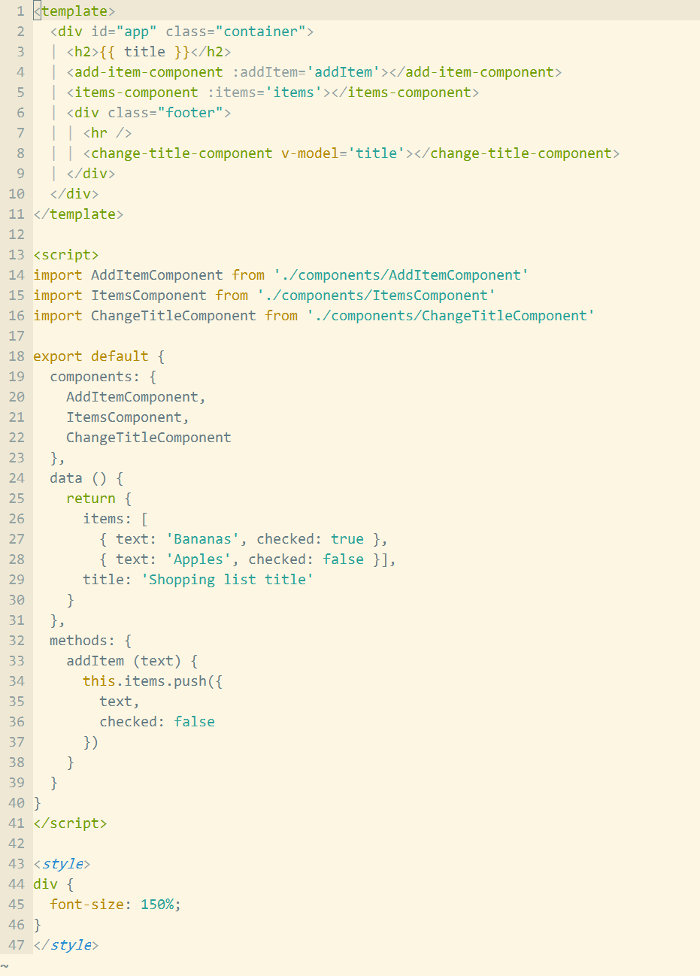

# vim-vue-plugin

Vim syntax and indent plugin for `.vue` files. Mainly inspired by [mxw/vim-jsx][1]. 

## Install

- Use [VundleVim][2]

        Plugin 'leafOfTree/vim-vue-plugin'

- Or manual: download `vim-vue-plugin` and drop it in `Vim/vimfiles`.

Plugin works if filetype is set to `javascript.vue`.

## How it works

Since `.vue` is a combination of CSS, HTML and JavaScript, so is `vim-vue-plugin`. (Like XML and JavaScript for `.jsx`).

Support `.wpy` files too.

## Configuration

Set global variable to `1` to enable or `0` to disable.

`g:vim_vue_plugin_has_init_indent`: initially indent one tab inside `style/script` tags. (default: 0 for `.vue` and 1 for `.wpy`)

    let g:vim_vue_plugin_has_init_indent = 1

`g: vim_vue_plugin_debug`: echo debug message in `messages` list. Useful to debug if indent errors occur.

## Screenshot

## Acknowledgments & Refs

[mxw/vim-jsx][1]

[Single File Components][3]

[1]: https://github.com/mxw/vim-jsx "mxw: vim-jsx"
[2]: https://github.com/VundleVim/Vundle.vim
[3]: https://vuejs.org/v2/guide/single-file-components.html
